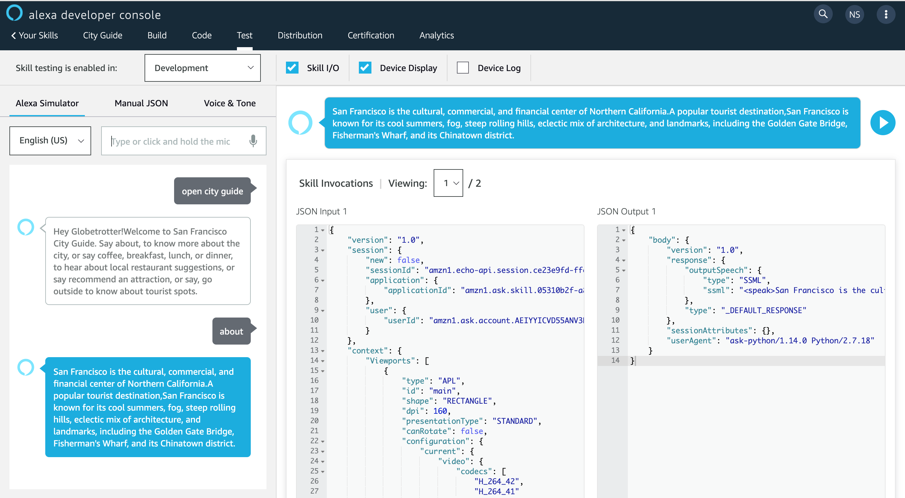
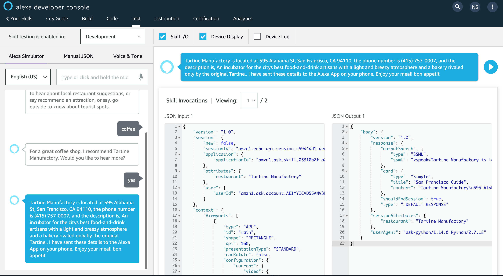
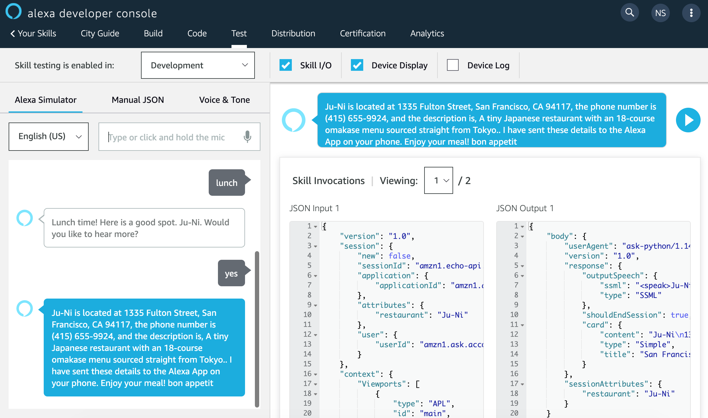
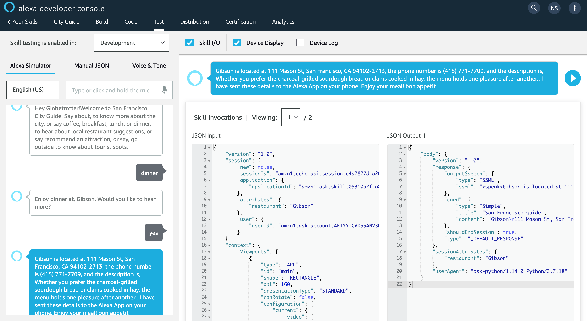
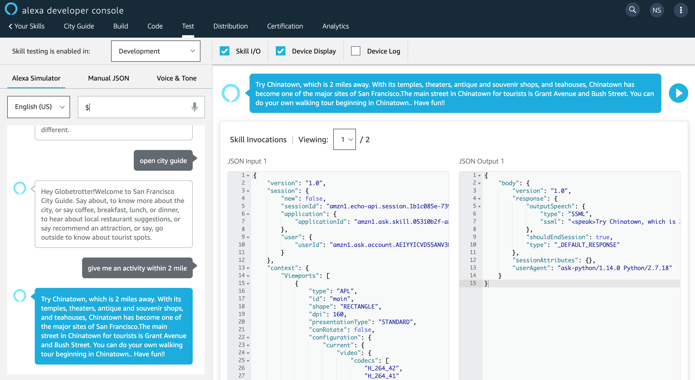

# San Francisco City Guide
## Alexa Skill for San Francisco City Guide

This project deals with the creation and UX testing of an Alexa skill for San Francisco city guide.The Alexa skill, on invocation, returns the information about San Francisco, coffee, breakfast, lunch and dinner joints.You can also ask Alexa about toursist attractions in San Francisco.

### Screenshots of the skill in the development phase 

#### Skill Invocation Name: open city guide

#### Asking about San Francisco:

#### Asking about Coffee Joints:

#### Asking about Lunch Joints: 

#### Asking about Dinner Joints: 

#### Asking about a Tourist Attraction: 
.png)

#### Asking about an Activity within a Given Distance:

#### Asking about a Tourist Attraction within a Given Distance: 
.png)

